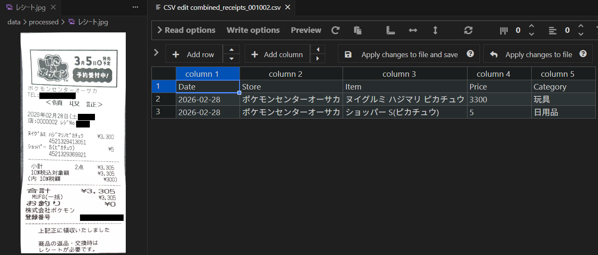

# 🧾 Receipt-to-CSV (Offline Receipt Parser with Local LLM)

**完全にオフラインで動く、レシート画像をCSVに変換する家計簿ツール**  
Ollama + Qwen2.5-VLでプライバシーを守りながら、店名・日付・商品・価格・カテゴリを自動抽出します。


*(左: 元画像 / 右: 解析後CSV例)*

### 📂 Project Structure
プロジェクトは以下のディレクトリ構成を想定しています。
```bash
.
├── main.py
├── ai_classifie.py
├── data/
│   ├── input/          # 入力フォルダ
│   ├── output/         # csv出力先
│   └── processed/      # 処理済みファイル移動
├── requirements.txt
└── README.md
```

### 特徴
- **完全ローカル実行** → 画像が外部に一切送信されない
- 半角カタカナも正確に認識（Tesseractより強い）
- カテゴリ自動分類（食費/日用品/娯楽など）
- 処理済み画像は自動で`processed`フォルダへ移動（二重取り防止）

### クイックスタート
```bash
# 1. Ollamaインストール後
ollama pull qwen2.5-vl:3b

# 2. リポジトリclone
git clone https://github.com/あなたのユーザー名/receipt-to-csv-local.git
cd receipt-to-csv-local

# 3. 実行
python main.py
```
レシート画像をdata/input/に入れるだけで、data/output/YYYY-MM-DD/にCSVが自動保存されます。

## 🛠 技術スタック
**・Python 3.10+**  
**・Ollama + qwen2.5-vl:3b**  
**・Pillow, pandas**  

## Why Local LLM?

多くのOCRサービスはクラウド送信を前提としていますが、
家計簿用途ではプライバシーを重視し、
Ollama + Qwen2.5-VL による完全ローカル処理を採用しました。

## 📝 プロンプトのカスタマイズ
商品のカテゴリや抽出ルールは `ai_classifie.py` 内の `prompt` 変数で調整できます。  
自分の家計簿スタイルに合わせて自由に書き換えてください（例：カテゴリを増やしたい場合など）。

## 📄 License
MIT License - 自由に使って・改変してください！
